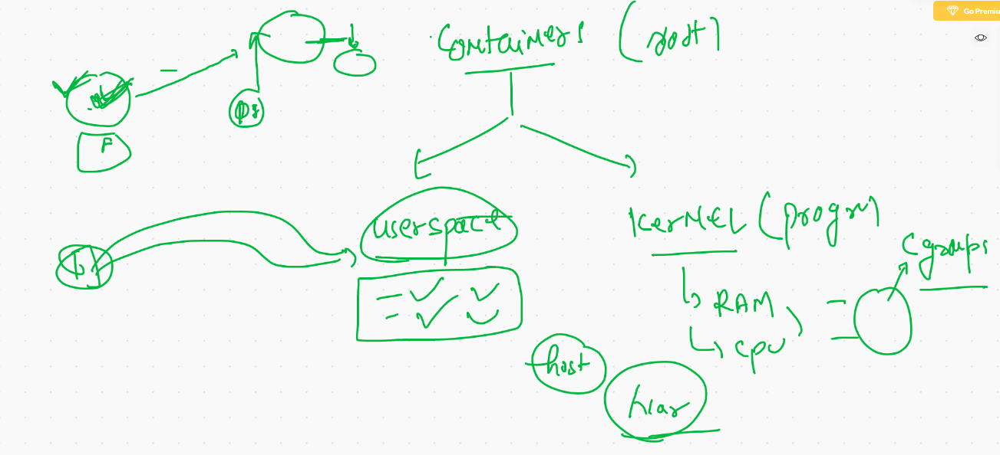
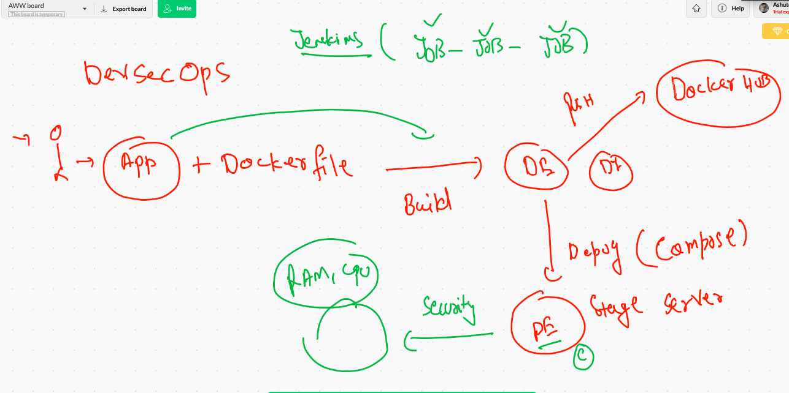
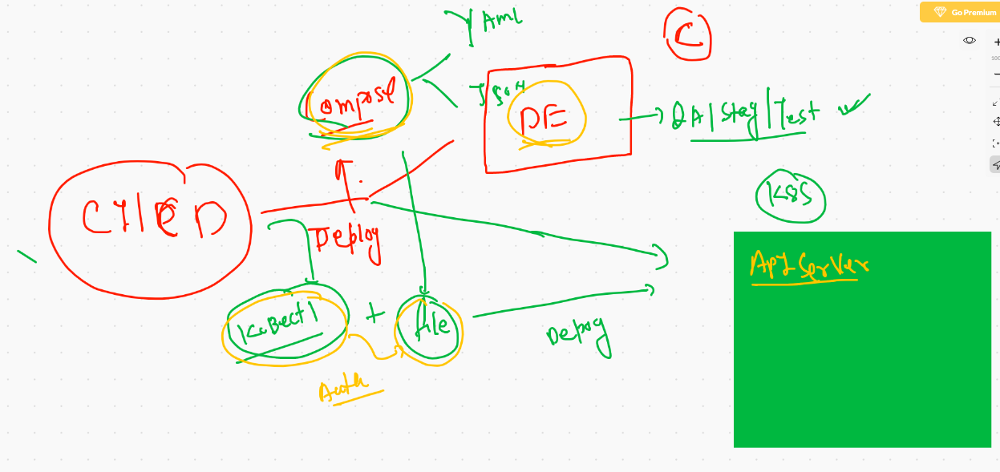

# Container Security with Namespace / cgroups and userspace 



## creating a new branch on GITHUB for another application 

```
git clone URL
git checkout -b htmlapp
rm *
mkdir ashuwebapp
cd ashuwebapp
# create pages and images
cd ..
git add .
git commit -m "any message"
git push origin html 
# it will ask for useranme and password of git hub 

```

##  udpating image


## Role of Security Engineer 


## check resources consumption by Containers

```
 docker  stats
 
 CONTAINER ID        NAME                CPU %               MEM USAGE / LIMIT     MEM %               NET I/O             BLOCK I/O           PIDS
4f8587c90bf5        x1                  0.01%               676KiB / 3.851GiB     0.02%               10kB / 9.12kB       0B / 0B             1
fbe1912a745a        satishd2            0.29%               34.45MiB / 3.851GiB   0.87%               1.73kB / 0B         0B / 0B             3

```

## updating jenkins pipeline mode 



## K8s arch for app deployment with client 



## Installing Kubectl on jenkins (CI|CD) server

### you can install kubectl in any OS where your jenkins is running 

## installing kubectl on LInux Based platform 

```
curl -LO "https://storage.googleapis.com/kubernetes-release/release/$(curl -s https://storage.googleapis.com/kubernetes-release/release/stable.txt)/bin/linux/amd64/kubectl"

===
chmod +x ./kubectl

sudo mv ./kubectl /usr/bin/kubectl

```

# making jenkins as Client of Kubernetes

```
-bash-4.2$ whoami
jenkins
-bash-4.2$ pwd
/var/lib/jenkins
-bash-4.2$ mkdir .kube 

```
