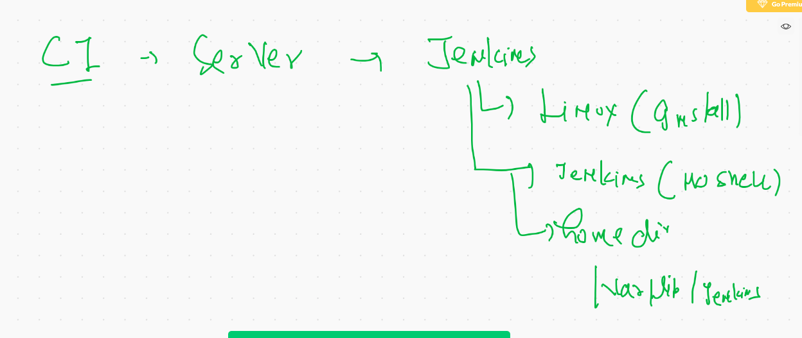
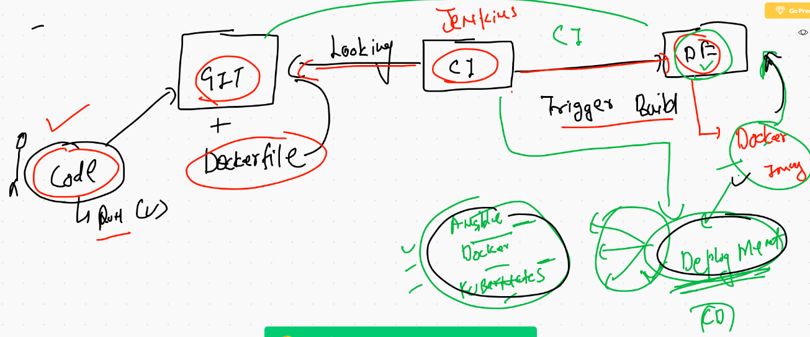
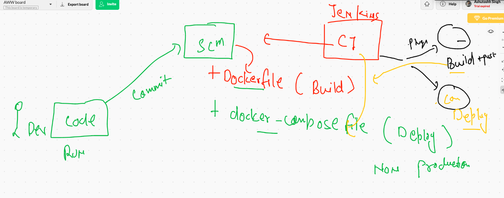

# Devsecops 

## Container Security 


## COnfigure Docker Host variable Globally 

```
root@ip-172-31-78-109 ~]# cat  /etc/profile
# /etc/profile

# System wide envir

# in the last line 

export DOCKER_HOST="tcp://34.204.241.101:2375"

```

## Jenkins more info 



## CI | CD 



## shell script for container check and launch 

```
( docker kill arthurC && docker rm arthurC ) || sleep 1
docker run --name arthurC -d -p 4444:5000 arthurflask:v1

```

## CI | CD with Docker compose | Dockerfile using Jenkins 




## Install docker-compoe intall

```
 68  sudo curl -L "https://github.com/docker/compose/releases/download/1.27.4/docker-compose-$(uname -s)-$(uname -m)" -o /usr/local/bin/docker-compose
   69  sudo chmod +x /usr/local/bin/docker-compose
   70  sudo ln -s /usr/local/bin/docker-compose /usr/bin/docker-compose
   71  docker-compose  -v

```

