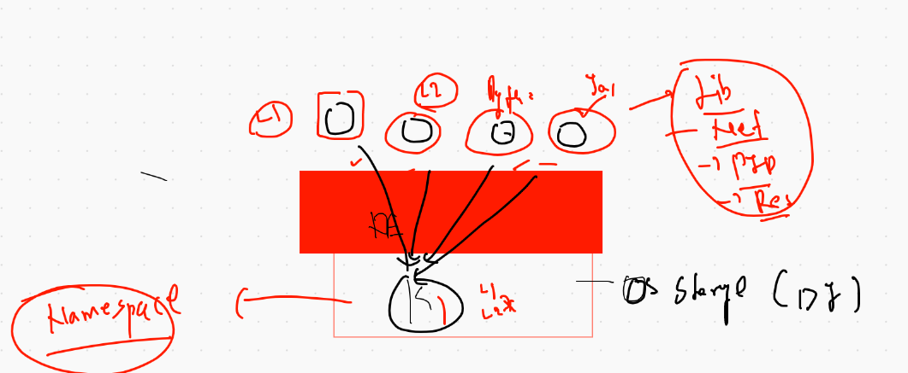

# Devsecops 

## Container Security 



## COnfigure Docker Host variable Globally 

```
root@ip-172-31-78-109 ~]# cat  /etc/profile
# /etc/profile

# System wide envir

# in the last line 

export DOCKER_HOST="tcp://34.204.241.101:2375"

```
