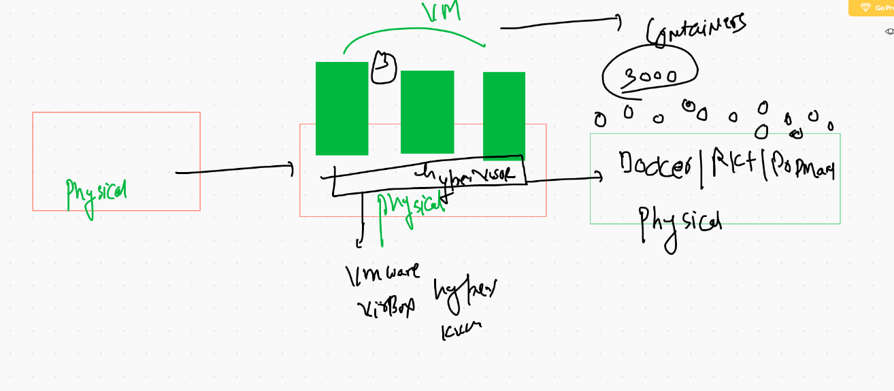
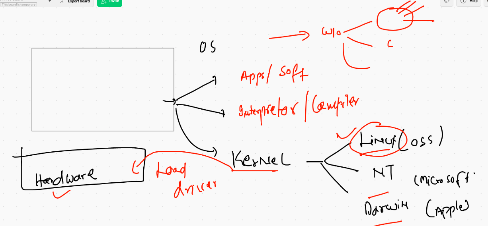
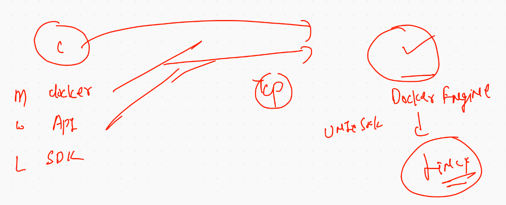
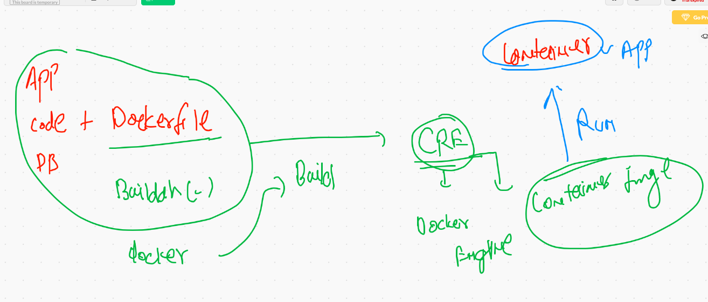
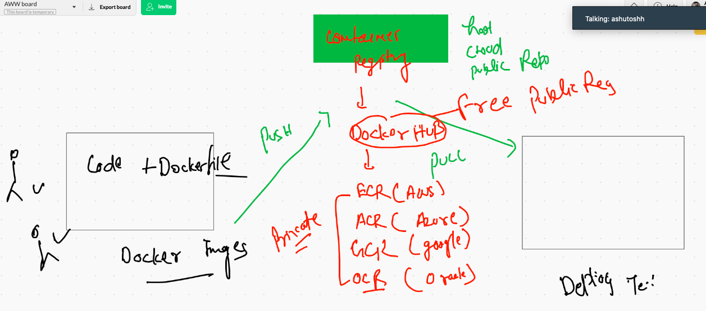
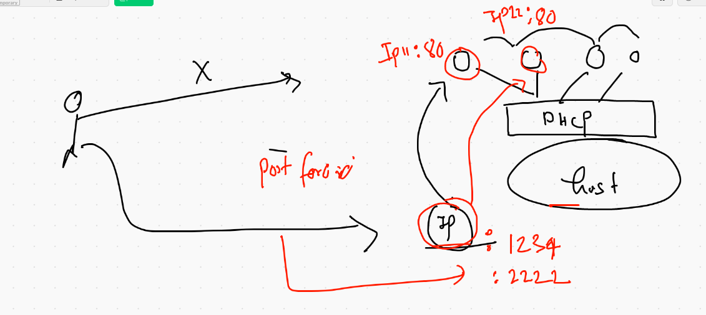
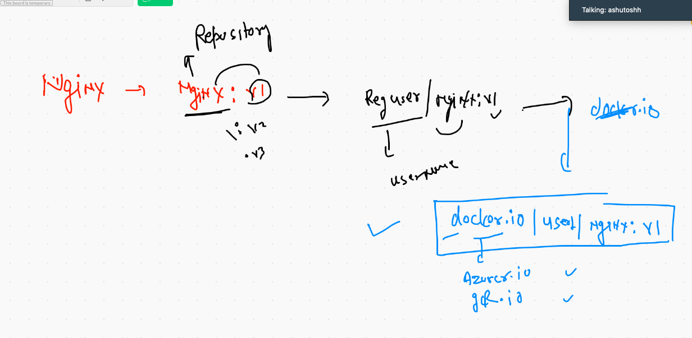

# DevsecOPs

##  resource discussion 


## physical to containers 



## Os components



## Docker Desktop 

[for mac os] ('https://hub.docker.com/editions/community/docker-ce-desktop-mac')

##  for windows 10

[windows 10] ('https://hub.docker.com/editions/community/docker-ce-desktop-windows/')


## Install docker in Amazon Linux vm 

```
root@ip-172-31-73-230 ~]# yum install  docker  -y
Failed to set locale, defaulting to C
Loaded plugins: extras_suggestions, langpacks, priorities, update-motd
amzn2-core                                                              | 3.7 kB  00:00:00     
Resolving Dependencies
--> Running transaction check
---> Package docker.x86_64 0:19.03.6ce-4.amzn2 will be installed
--> Processing Dependency: runc >= 1.0.0 for packa

```

## starting docker engine on any linux platform 

```
root@ip-172-31-73-230 ~]# systemctl status  docker 
● docker.service - Docker Application Container Engine
   Loaded: loaded (/usr/lib/systemd/system/docker.service; disabled; vendor preset: disabled)
   Active: active (running) since Mon 2020-11-02 05:38:20 UTC; 33s ago
     Docs: https://docs.docker.com
  Process: 4328 ExecStartPre=/usr/libexec/docker/docker-setup-runtimes.sh (code=exited, status=0/SUCCESS)
  Process: 4315 ExecStartPre=/bin/mkdir -p /run/docker (code=exited, status=0/SUCCESS)
 Main PID: 4331 (dockerd)
    Tasks: 10
   Memory: 36.4M
   CGroup: /system.slice/doc
  
 ```
 
 ## adding a non root user into Docker group
 
 ```
 usermod -aG docker username
 ```
 
## COnnecting to Docker engine 



## creating container using docker images

<di.png>

## Docker basic operations 

```
 6  docker  version 
    7  docker  search  mongodb 
    8  docker  images  
    9  docker  pull  java
   10  docker  images  
   11  docker  pull  python 
   12  docker  pull  mysql 
   
 ```
 
 ## PYthon Code 
 
 ```
 import  time,subprocess

while 2 > 1 :
    print("Hello Oracle !!")
    time.sleep(1)
    kernel_check=subprocess.getoutput('uname -r')
    print("check kernel version ....")
    time.sleep(2)
    print("found linux kernel version is ",kernel_check)
    print("_______")
    print("_______")
    print("_______")
```
    
    
## Pyhon code

```
FROM  python
#  i am connecting to DE  and  asking python base docker  image 
MAINTAINER   ashutoshh@linux.com 
# optional field ; DevInfo 
RUN  mkdir /mycode 
#  use of RUN to execute any shell command in python based  contianer 
COPY  hello.py  /mycode/hello.py 
# it will take hello.py from Host  OS  and copy it docker image 
#  copy can only take data from the place where dockerfile is present 
WORKDIR  /mycode
# similar to cd command in linux/windows 
RUN  chmod +x  hello.py
# how to run code automatically when you create contaienr from the Docker image
CMD  ["python","hello.py"]

```


## Building Docker image with Python code & Dockerfile

```
[ec2-user@ip-172-31-73-230 pycode]$ docker  build  -t  ashuoraclepy:v1 .
Sending build context to Docker daemon  3.584kB
Step 1/7 : FROM  python
 ---> 5336a27a9b1f
Step 2/7 : MAINTAINER   ashutoshh@linux.com
 ---> Running in 9800e7b26950
Removing intermediate container 9800e7b26950
 ---> ad033f70c1ac
Step 3/7 : RUN  mkdir /mycode
 ---> Running in 6d7ffe4639b4
Removing intermediate container 6d7ffe4639b4
 ---> 35792ad8d0d4
Step 4/7 : COPY  hello.py  /mycode/hello.

```

## creating contaienr from Docker image

```
[ec2-user@ip-172-31-73-230 ~]$ docker  images
REPOSITORY           TAG                 IMAGE ID            CREATED             SIZE
satishorcle          v1                  43b609895d46        4 minutes ago       886MB
manish               v1                  3de440ad37a6        12 minutes ago      886MB
arthurpy             v1                  82a89c6754db        12 minutes ago      886MB
rashmioracle         v1                  72b649315cae        12 minutes ago      886MB
anandpy              v1                  31a365bb7c9c        15 minutes ago      886MB
ashuoraclepy         v1                  44b3ffc4fa0f        15 minutes ago      886MB
mysql                latest              db2b37ec6181        10 days ago         545MB
python               latest              5336a27a9b1f        12 days ago         886MB
securecodebox/nmap   latest              0d7ffd5f5c30        4 weeks ago         31.6MB
java                 latest              d23bdf5b1b1b        3 years ago         643MB
[ec2-user@ip-172-31-73-230 ~]$ docker  run  --name  ashuc1 -it  -d  ashuoraclepy:v1 
d0f69ec7a4b7200eac154bb55259f706abfa62cf97408d4eb3f32e271964eeb4
[ec2-user@ip-172-31-73-230 ~]$ docker  ps
CONTAINER ID        IMAGE               COMMAND             CREATED             STATUS              PORTS               NAMES
d0f69ec7a4b7        ashuoraclepy:v1     "python hello.py"   8 seconds ago       Up 7 seconds                            ashuc1
[ec2-user@ip-172-31-73-230 ~]$ 


```

## checking output of programe running in container 

```
 55  docker  logs  ashuc1 
   56  history 
   57  docker  logs -f   ashuc1 
 ```

## running a child process in a alread running container 

```
  20  docker  exec  -it  ashuc1   bash
   21  docker  exec  -it -d ashuc1   ping  8.8.8.8
   
```
## checking resources by Containers 

```
 27  docker  stats  ashuc1 
   28  docker  stats  
   
```
## More operations on containers

```
docker  kill  ashuc1
docker  start  ashuc1
docker  rm   ashuc1
```


## Container image and instance creation 



## On the SErver Side starting Docker engine on Tcp socket 

```
[root@ip-172-31-73-230 ~]# cat  /etc/sysconfig/docker
# The max number of open files for the daemon itself, and all
# running containers.  The default value of 1048576 mirrors the value
# used by the systemd service unit.
DAEMON_MAXFILES=1048576

# Additional startup options for the Docker daemon, for example:
# OPTIONS="--ip-forward=true --iptables=true"
# By default we limit the number of open files per container
OPTIONS="--default-ulimit nofile=1024:4096  -H tcp://0.0.0.0:2375"

# How many seconds the sysvinit script waits for the pidfile to appear
# when starting the daemon.
DAEMON_PIDFILE_TIMEOUT=10
[root@ip-172-31-73-230 ~]# systemctl daemon-reload   ^C
[root@ip-172-31-73-230 ~]# systemctl restart docker 

```

## Making Client of Docker engine 

### for Mac based Client 

```
export DOCKER_HOST="tcp://34.204.241.101:2375"
```

### For windows 10 based client 

```
## only on Powershell not in CMD 
$env:DOCKER_HOST="tcp://34.204.241.101:2375"

```

# Nginx web server 


## Deploying sample application with Nginx web server 

## Clone repo 

```
git clone  https://github.com/mdn/beginner-html-site-styled
cd beginner-html-site-styled
```

## adding dockerfile here 

```
[ec2-user@ip-172-31-73-230 beginner-html-site-styled]$ cat  Dockerfile 
FROM  nginx
# connecting to docker engine and asking to pull nginx image from  Docker hub if not present locally 
MAINTAINER  ashutoshh@linux.com
WORKDIR  /usr/share/nginx/html/
COPY  .  .
# first . means source from Host machine
#  second . means current working directory under container 
EXPOSE 80

```

## adding .dockerignore

```
cat  .dockerignore 
*.md
LICENSE
Dockerfile
.dockerignore
.git
[ec2-user@ip-172-31-73-230 beginner-html-site-styled]$ ls -a
.  ..  .dockerignore  .git  CODE_OF_CONDUCT.md  Dockerfile  LICENSE  README.md  images  index.html  styles

```


## building Docker image with webapp

```
[ec2-user@ip-172-31-73-230 beginner-html-site-styled]$ docker  build  -t  nginxashuweb:v1        .
Sending build context to Docker daemon  63.49kB
Step 1/5 : FROM  nginx
latest: Pulling from library/nginx
bb79b6b2107f: Already exists 
111447d5894d: Pull complete 
a95689b8e6cb: Pull complete 
1a0022e444c2: Pull complete 
32b7488a3833: Pull complete 
Digest: sha256:ed7f815851b5299f616220a63edac69a4cc200e7f536a56e421988da82e44ed8
Status: Downloaded newer image for nginx:latest
 ---> f35646e83998
Step 2/5 : MAINTAINER  ashutoshh@linux.com
 ---> Running in 610f32413d4b
Removing intermediate container 610f32413d4b
 ---> e29783e70eb3
Step 3/5 : WORKDIR  /usr/share/nginx/html/
 ---> Running in 2a6b41b40c63
Removing intermediate container 2a6b41b40c63
 ---> 583fce6a2227
Step 4/5 : COPY  .  .
 ---> 596b63ae8b8a
Step 5/5 : EXPOSE 80
 ---> Running in c583cd2614e3
Removing intermediate container c583cd2614e3
 ---> e0eb90551ae8
Successfully built e0eb90551ae8
Successfully tagged nginxashuweb:v1

```

## Creation rules for a contaienr to access from External world

```
[ec2-user@ip-172-31-73-230 ~]$ docker run  -d  --name ashuc2 -p  1234:80  nginxashuweb:v1  
e834502e209bf96dcb212a0c484a4fd53eb6979bc8c00d3212560a33d68dd2dc
[ec2-user@ip-172-31-73-230 ~]$ docker  ps
CONTAINER ID        IMAGE               COMMAND                  CREATED             STATUS              PORTS                  NAMES
e834502e209b        nginxashuweb:v1     "/docker-entrypoint.…"   3 seconds ago       Up 2 seconds        0.0.0.0:1234->80/tcp   ashuc2

```

## Docker images sharing between hosts







## image name understanding



## Image pushing on Docker HUB 

### tagging 
```
 docker  tag   nginxashuweb:v1    dockerashu/nginxashuweb:v1  
 
 ```
 
 ### docker hub Login 
 
 ```
 [ec2-user@ip-172-31-73-230 ~]$ docker  login  -u dockerashu 
Password: 
WARNING! Your password will be stored unencrypted in /home/ec2-user/.docker/config.json.
Configure a credential helper to remove this warning. See
https://docs.docker.com/engine/reference/commandline/login/#credentials-store

Login Succeeded

```

### Pushing image

```
docker  push dockerashu/nginxashuweb:v1

```


