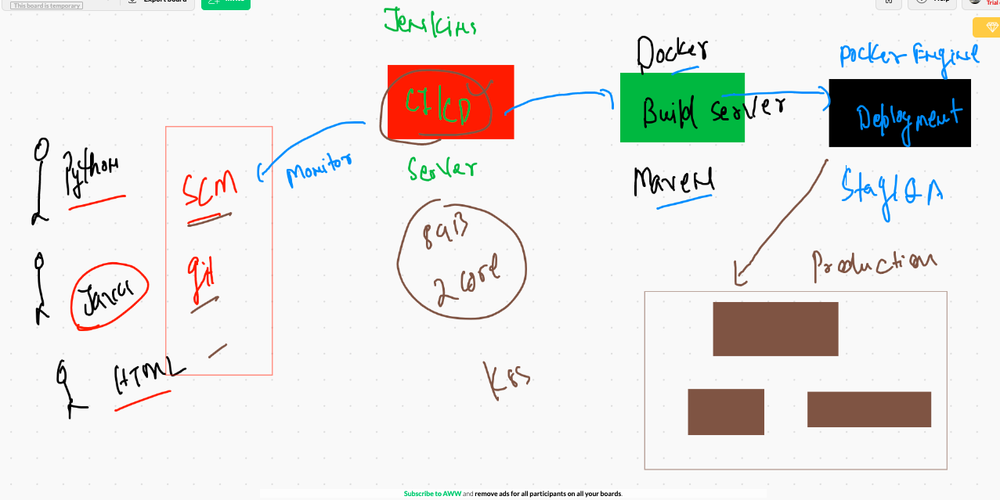

# DevSEcOPS

## CI|CD 




## deploying application in k8s and using service to access and loadbalance


## End user app deployment with DNS and LB 


## java based project 


## Installing maven on CI|CD server 

```
[root@ip-172-31-78-109 ~]# yum  install  java-1.8.0-openjdk  java-1.8.0-openjdk-devel  maven 

```

